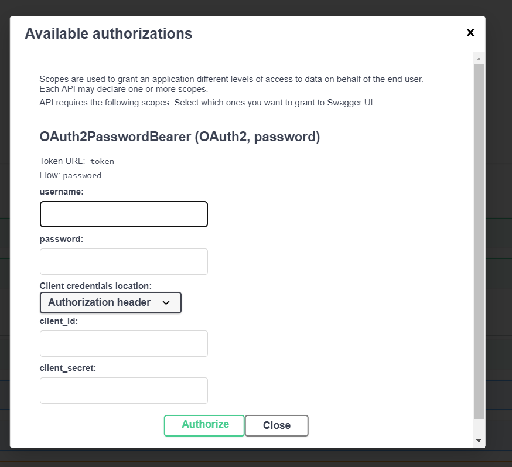

# Posts - FastAPI App with MongoDB (Dockerized)
**Dockerized Setup:** Easily spin up the entire app environment with just a single command using Docker Compose.

This is a FastAPI app that connects to MongoDB. The entire setup is Dockerized, so you can easily run it using Docker Compose.


## How to run

1. Clone the repository:

   ```bash
   git clone https://github.com/MukeshMahadev/posts-app.git
   cd posts-app
   ```
2. Build and run the app using Docker Compose:
```bash
   docker-compose up --build
   ```
3. Utilize the http://localhost:8000/docs endpoint to experiment with the API directly in your browser.

4. Sign-up using the /signup
5. Enter the username and password by clicking on "Authorize" and enter the details

6. Testing the App : 
After logging in, you can test various endpoints secured by OAuth2 authentication.


🚀 About This Project

This project is a FastAPI application that showcases a modern, scalable web service built with **Pydantic** for data validation and **Motor for asynchronous MongoDB operations**. Designed with OAuth2 authentication, this application ensures secure access while maintaining high performance and flexibility.

Key Features
- **FastAPI Framework:** Utilizing FastAPI, the app achieves high performance and offers automatic generation of interactive API documentation via Swagger and ReDoc.

- **Pydantic for Data Validation**: Pydantic models are employed for data validation and serialization, ensuring that incoming and outgoing data adheres to defined schemas.

- **Asynchronous MongoDB with Motor:** The app employs Motor, an asynchronous driver for MongoDB, allowing for non-blocking database interactions which improves performance under load.

- **Authentication and Authorization:** The app implements OAuth2 with password flow using FastAPI's OAuth2PasswordBearer, ensuring secure user authentication.

Project Structure
- **API Endpoints:** The application features endpoints for user signup, login, and secured access to resources.
- **Pydantic Models:** Data schemas for user registration and authentication are defined using Pydantic.
- **Database Operations:** Async CRUD operations are performed using Motor for seamless MongoDB interactions.

Also, with this application, you can:

🌐 Build blazing-fast APIs and services with minimal effort.

🗄️ Leverage the power of MongoDB for handling your data storage, offering flexibility, performance, and scalability.

🐳 Run the entire app stack seamlessly using Docker and Docker Compose, so you don’t have to worry about complex installations.


This project showcases how to deploy a microservice-based app with modern tools in a containerized environment. 🚀


- Dockerized Setup: Easily spin up the entire app environment with just a single command using Docker Compose.


Feel free to tweak this description to match your style or add any extra details specific to your app!